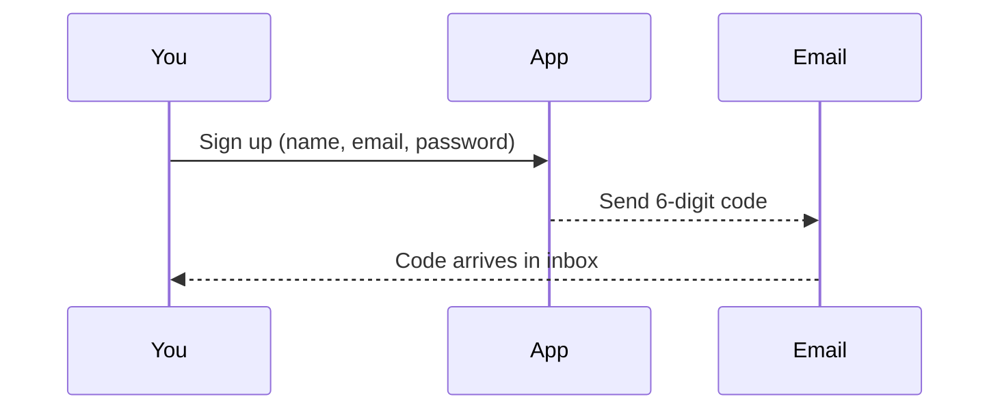
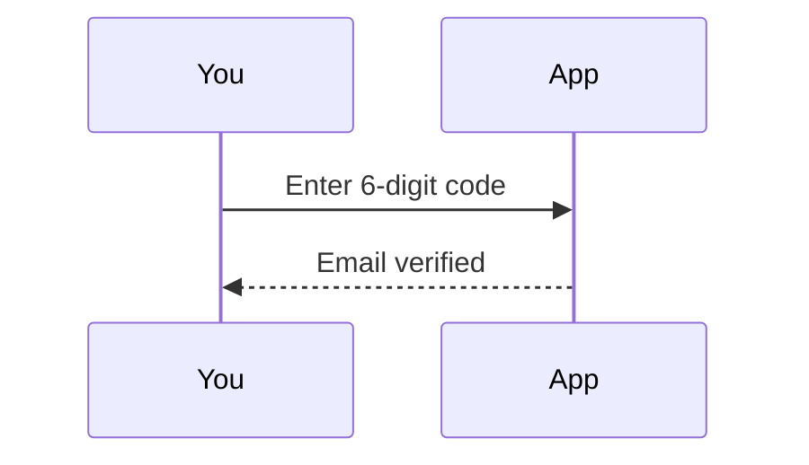
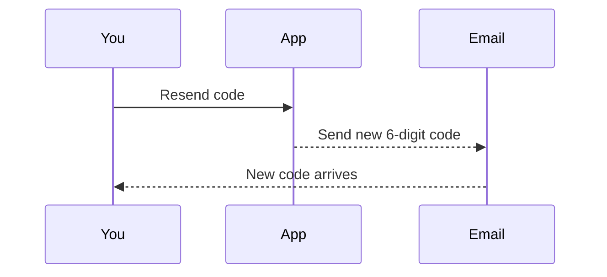
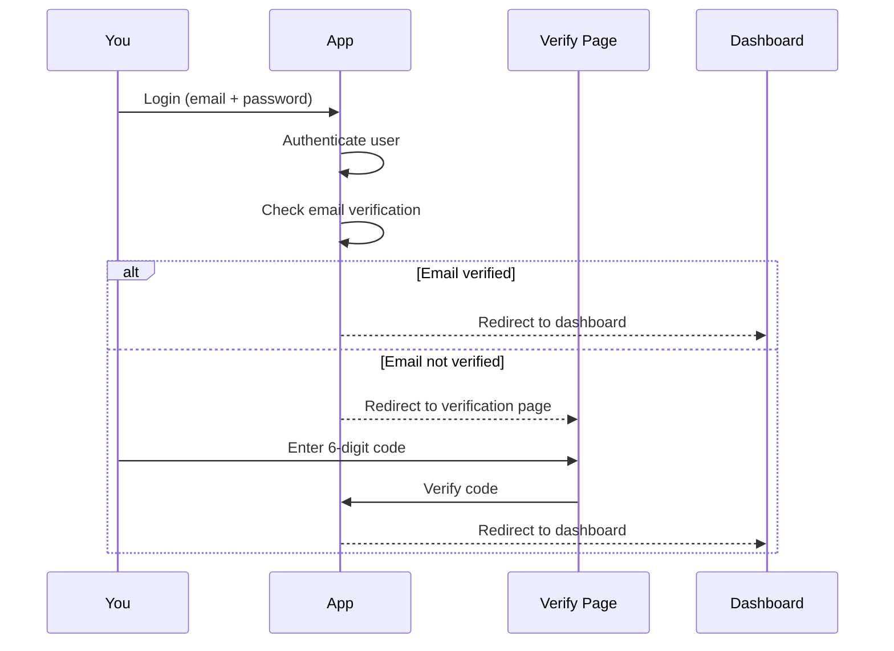
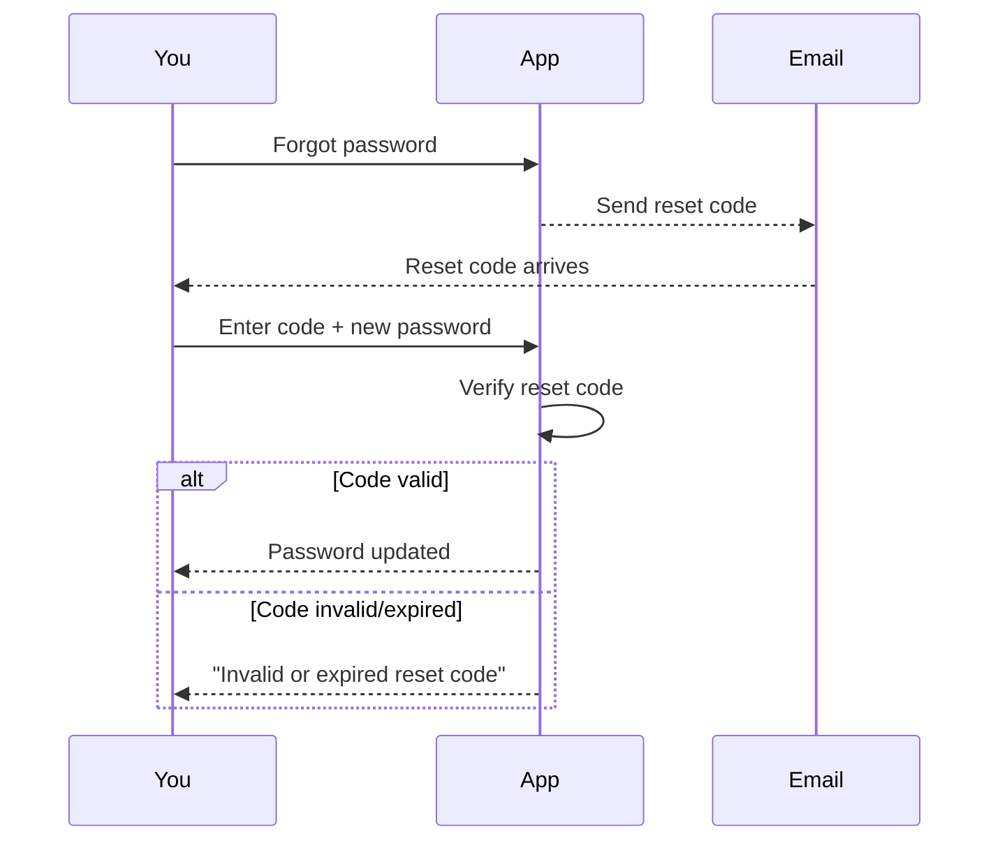

# Auth flow (simple overview)

## Signup (Registration)

- Enter your name, email, and password.
- We send a 6-digit code to your email.
- All users start as clients by default.

### Account types

- **Client**: Default role for personal projects and estimates.
- **Admin**: Manually promoted by system administrators for professional use and management.

### Role-based access

- **Client users** can access: Roof Calculator, Manual Calculator, Contractor Calculator, AI Recommendations, Archive, Project Management, Cost Customization
- **Admin users** have access to all client features plus: Account Management (user administration, billing, subscriptions)
- Account Management section is protected and only accessible to admin users

## Verify code

- You enter the code.
- Your email becomes verified.

## Resend code

- If the code expired or you didn’t get it, request a new one.

## Login

- Use your email and password.
- You can sign in even if your email is not verified.
- **Unverified users** will be redirected to the verification page.
- **Verified users** will go directly to the dashboard.

## Password reset

- Forgot your password? Get a 6-digit code, then set a new password.
- **Security**: The reset code must be entered to change your password.

