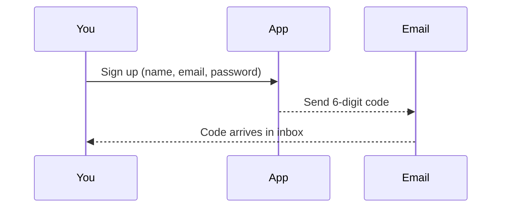
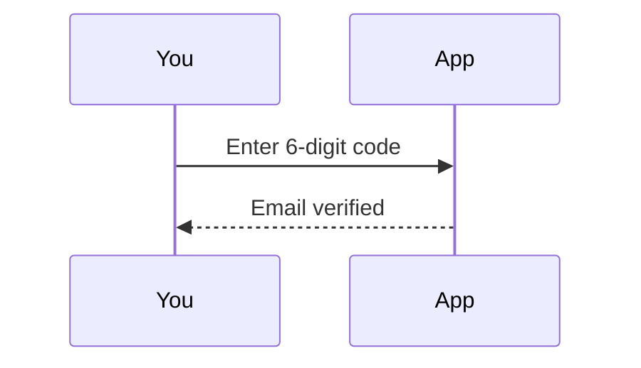
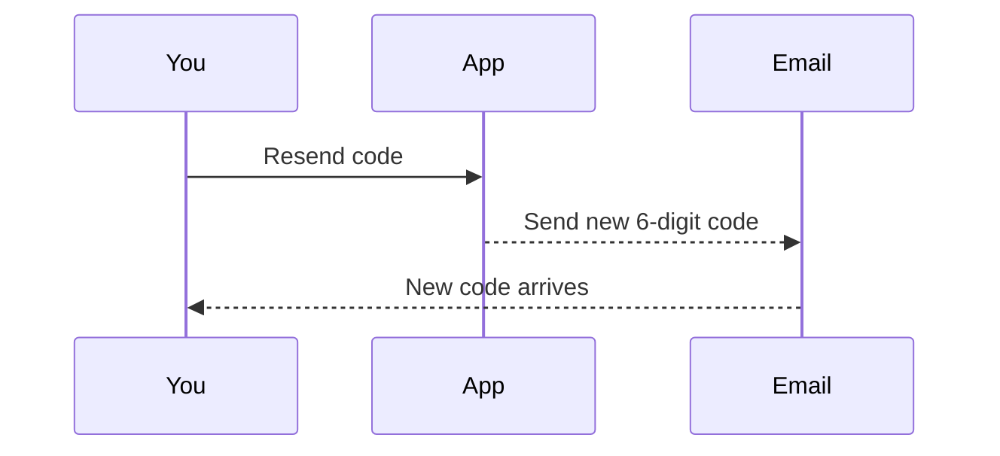
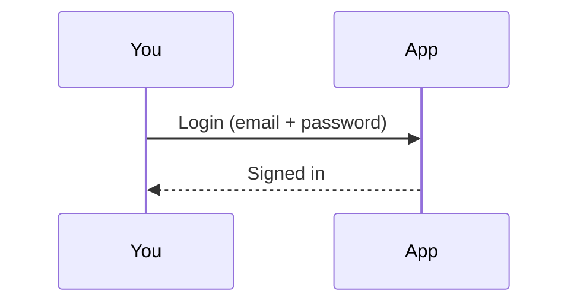
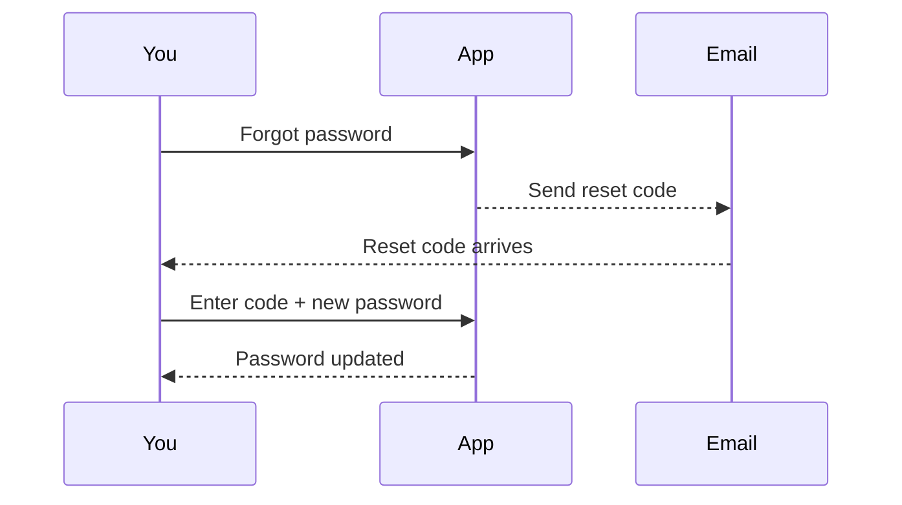

# Auth flow (simple overview)

## Signup (Registration)

- Enter your name, email, and password.
- We send a 6-digit code to your email.
- All users start as clients by default.

### Account types

- Client: Default role for personal projects and estimates.
- Admin: Manually promoted by system administrators for professional use and management.

## Verify code

- You enter the code.
- Your email becomes verified.

## Resend code

- If the code expired or you didn’t get it, request a new one.

## Login

- Use your email and password.
- Verified accounts can sign in.

## Password reset

- Forgot your password? Get a 6-digit code, then set a new password.

